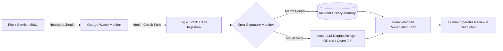

# 🚨 Outage Watch — Automated Outage Detection & Diagnosis Agent

<p align="center">
  <strong>A self-hosted, local observability and incident diagnosis copilot with heartbeat monitoring and incident memory.</strong>
</p>

<p align="center">
  <a href="#license"></a>
  <a href="https://flask.palletsprojects.com"></a>
  <a href="https://ollama.com"></a>
  <a href="https://www.python.org"></a>
</p>

---

## 📌 Overview

**Outage Watch** is a local-first, autonomous reliability engineering tool that combines heartbeat health checks, stack trace extraction, error fingerprinting, and LLM-assisted incident triage.

It simulates realistic production outages on demand, captures log signatures, queries a verified incident memory store (`incidents/incident_history.json`), and recommends proven, human-verified remediation steps.

> **🛡️ Core Reliability Rule: Recommend, Never Auto-Mutate.** Outage Watch operates strictly on a read-and-diagnose boundary. It never executes destructive restarts or unverified code patches without human review.

---

## 🏗️ System Architecture



---

## ✨ Key Features

- **⚡ Configurable Fault Injection:** Intentionally inject 5 distinct failure scenarios via the `/crash/<kind>` endpoint (`db`, `memory`, `timeout`, `nullref`, `disk`).
- **🧠 Incident Signature Memory:** Matches live error traces against `incidents/incident_history.json` by error class, exception type, and token similarity.
- **🤖 Local LLM Fallback Diagnosis:** Uses **Ollama + Qwen 2.5 7B** to analyze novel, unindexed error signatures and generate root-cause hypotheses.
- **🔄 Zero-Cloud Execution:** Runs 100% on your local machine with zero external SaaS dependencies.
- **📦 OpenClaw Integration:** Includes an `outage_skill.md` definition ready to bind to OpenClaw heartbeat schedulers.

---

## 💥 Simulated Failure Modes

| Kind | Triggered Scenario | Simulated Error Signature |
| :--- | :--- | :--- |
| `db` | Database connection pool exhaustion | `OperationalError: connection pool exhausted (max 10)` |
| `memory` | Heap / Buffer memory leak | `MemoryError: process exceeded 512MB heap threshold` |
| `timeout` | Upstream gateway / API timeout | `GatewayTimeout: downstream payment API timed out after 30s` |
| `nullref` | Unhandled NullPointerException / TypeError | `AttributeError: 'NoneType' object has no attribute 'get'` |
| `disk` | Disk full / File write permission error | `IOError: [Errno 28] No space left on device` |

---

## 🚀 Quick Start

### 1. Launch the Target Application

```bash
# Clone the repository
git clone https://github.com/MadanMohan0537/Outage-Watch.git
cd Outage-Watch/app

# Set up Python environment
python3 -m venv .venv
# Windows: .venv\Scripts\activate | Linux/macOS: source .venv/bin/activate
pip install -r requirements.txt

# Start application server
python app.py # Serves at http://localhost:5001
```

### 2. Trigger an Outage & Run Diagnosis

In a second terminal window:

```bash
cd ../scripts

# Trigger a database outage
python crash_trigger.py db

# Run automated detection & diagnosis
python diagnose.py --use-llm
```

### 3. Reset Service to Healthy State

```bash
curl -X POST http://localhost:5001/recover
```

---

## 📄 License

MIT License — see [LICENSE](LICENSE) for details.
